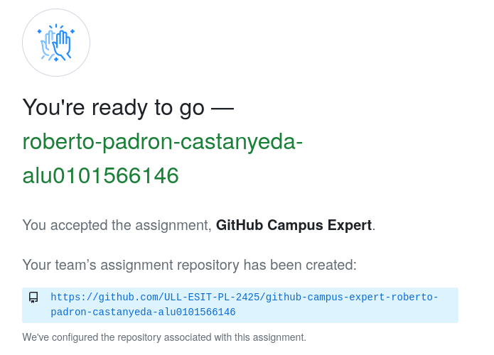
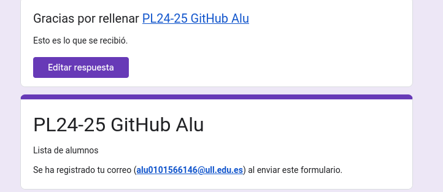
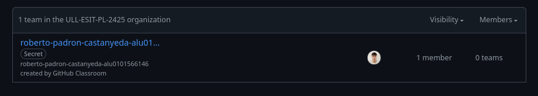
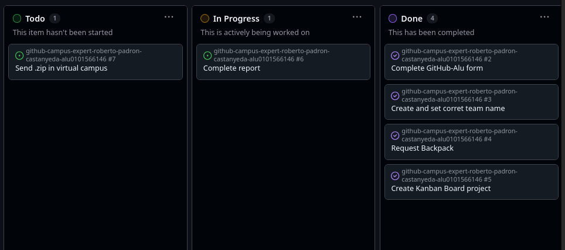

# Github Campus Expert 

- Roberto
- Padrón Castañeda 
- alu0101566146

## Aceptar la tarea 

He acpetado la tarea

## Rellenar el cuestionario GitHub-Alu del campus virtual y recibir el correo confirmándolo

He rellenado el couestionario de GitHub-Alu

## Crear equipo con nombre correcto

He creado un equipo con el nombre correcto

## Crear un project board kanban para este repositorio

He creado un project board kanban

## Solicitar el GitHub Backpack

